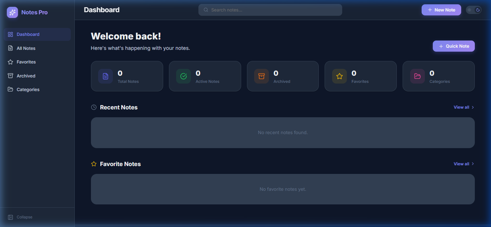
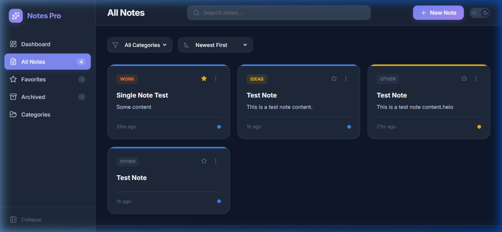
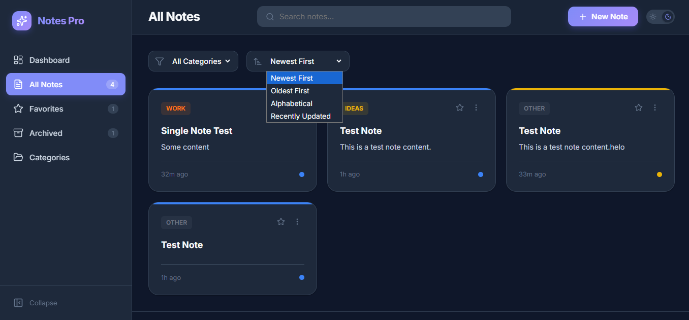
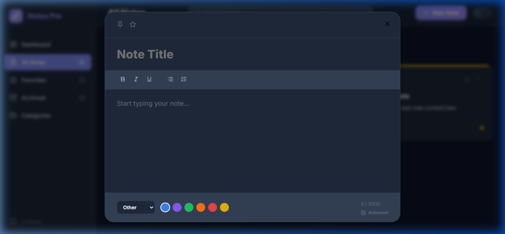
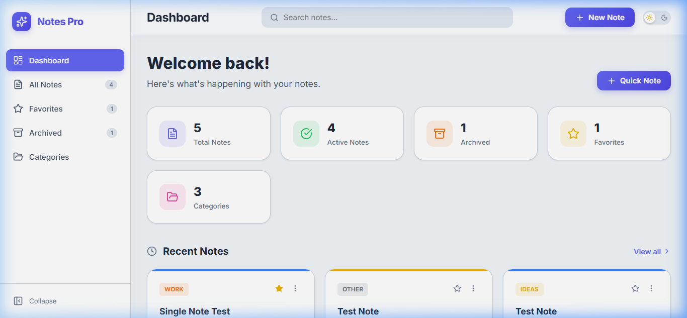
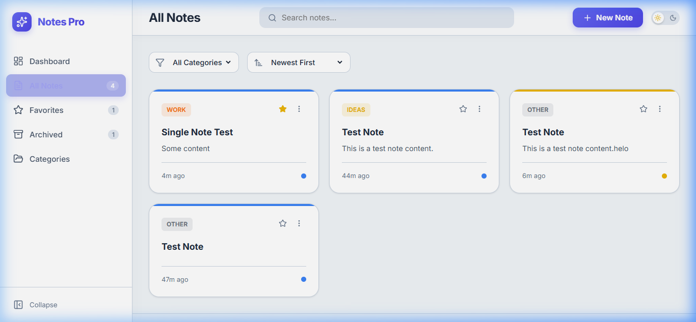
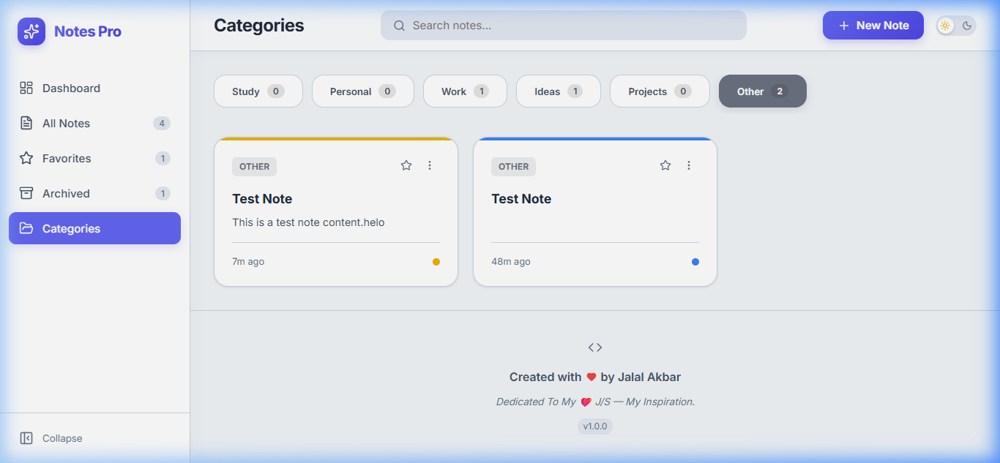
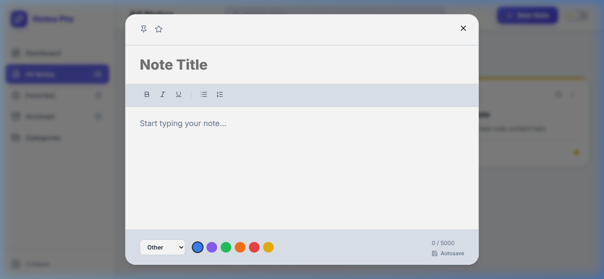

# Notes App Pro 📝

[](https://github.com/jalalakbar47/Notes-App-Pro/search?l=javascript)
[](https://react.dev/)
[](https://github.com/jalalakbar47/Notes-App-Pro/actions/workflows/copilot-swe-agent/copilot)
[](https://github.com/jalalakbar47/Notes-App-Pro/stargazers)
[](https://github.com/jalalakbar47/Notes-App-Pro/network/members)
[](https://github.com/jalalakbar47/Notes-App-Pro/issues)
[](https://github.com/jalalakbar47/Notes-App-Pro/commits/main)
[](https://notes-app-pro-six.vercel.app)

**Notes App Pro** is a modern, professional, portfolio-grade React application designed for cross-platform note management. It features a premium SaaS-style user interface with rich editing capabilities, advanced categorization, and seamless search.

## 📸 Screenshots

### Dark Mode (Default)
| Dashboard | All Notes |
|---|---|
|  |  |

| Categories View | Note Editor |
|---|---|
|  |  |

### Light Mode
| Dashboard | All Notes |
|---|---|
|  |  |

| Categories View | Note Editor |
|---|---|
|  |  |

## ✨ Features

*   🚀 **Premium UI/UX**: Modern glassmorphism design with a dark mode first approach.
*   📝 **Rich Note Editor**: Lightweight text formatting (Bold, Italic, Lists) with character counting.
*   💾 **Auto Save**: Never lose your work with background persistence to LocalStorage.
*   📌 **Organization**: Pin, Archive, and Favorite notes for better productivity.
*   🎨 **Customization**: 6 color labels and 6 categories (Work, Personal, Ideas, etc.) with unique icons.
*   📊 **Dashboard**: Real-time statistics and quick-access view for recent and favorite notes.
*   🔍 **Instant Search**: Blaze-fast search through titles, content, and categories.
*   🔔 **Toast Notifications**: Minimalist and beautiful feedback for every action.
*   📱 **Fully Responsive**: Optimized for Desktop, Tablet, and Mobile devices.

## 🛠️ Tech Stack

*   **Frontend**: React.js (Vite)
*   **Styling**: Vanilla CSS (CSS Variables, Flexbox, Grid)
*   **Icons**: Lucide React
*   **State Management**: React Context API
*   **Storage**: LocalStorage API

## 📂 Folder Structure

```text
src/
├── components/        # Reusable UI components (Header, Sidebar, NoteCard, etc.)
├── context/           # State management using Context API
├── pages/             # Page views (Dashboard, Archive, etc.)
├── utils/             # Helper functions (Date formatting, LocalStorage)
├── App.jsx            # Main app router and layout
├── main.jsx           # React entry point
└── index.css          # Global styles & Design System
```

## 🚀 Installation

1. Clone the repository:
```bash
git clone https://github.com/jalalakbar47/notes-app-pro.git
```
2. Install dependencies:
```bash
npm install
```
3. Start the development server:
```bash
npm run dev
```

## 🔮 Future Improvements

*   [ ] Cloud Sync with Firebase/Supabase
*   [ ] Voice-to-text note creation
*   [ ] Collaborative note sharing
*   [ ] PDF Export for notes

## 👤 Author

**Jalal Akbar**
*   GitHub: [@JalalAkbar](https://github.com)

## ❤️ Dedication

Dedicated To My ❤️ J/S — My Inspiration.

---
Created with ❤️ by Jalal Akbar | v1.0.0
